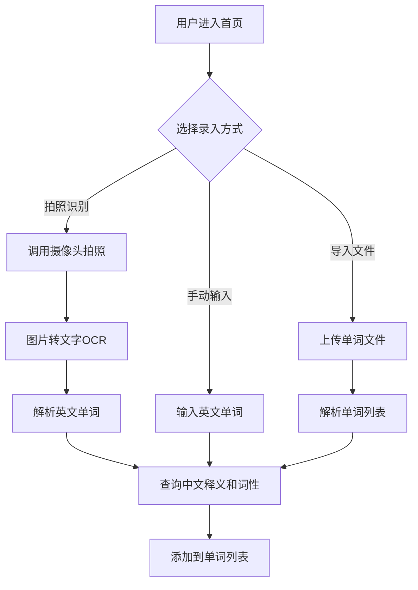
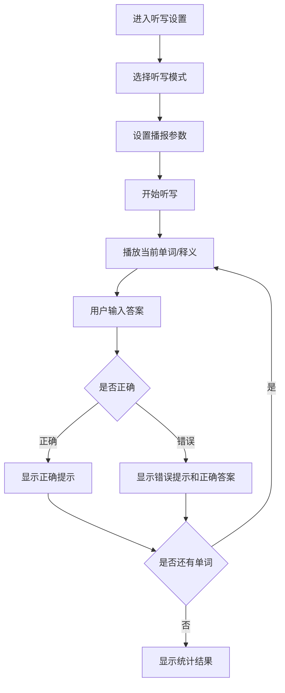

## 1. Product Overview
一个英语单词听写学习网页应用，通过拍照识别单词并补充中文释义和词性，生成可打印的听写练习格式，并提供语音听写功能（支持报中文/英文模式），支持设置听写次数、间隔和语速。

- **主要用途**: 帮助学生高效学习英语单词，通过拍照快速录入单词，生成听写练习材料，支持语音听写模拟考试场景
- **目标用户**: 学生、英语学习者、教师
- **市场价值**: 简化单词录入流程，提供沉浸式听写体验，提高学习效率

## 2. Core Features

### 2.1 User Roles
| Role | Registration Method | Core Permissions |
|------|---------------------|------------------|
| Normal User | No registration required | Full access to all features |

### 2.2 Feature Module
1. **首页/单词列表页**: 单词列表展示、拍照识别、手动添加单词
2. **听写设置页**: 听写模式选择（报中文/报英文）、次数设置、间隔设置、语速设置
3. **听写练习页**: 语音播放、答题输入、进度显示、结果统计
4. **打印预览页**: 生成听写版打印格式

### 2.3 Page Details
| Page Name | Module Name | Feature description |
|-----------|-------------|---------------------|
| 首页 | 单词列表 | 展示已录入的单词，支持编辑、删除、清空 |
| 首页 | 拍照识别 | 调用摄像头拍照，自动识别图片中的英文单词 |
| 首页 | 手动添加 | 手动输入英文单词，自动获取中文释义和词性 |
| 首页 | 导入导出 | 支持导入单词列表，导出为JSON格式 |
| 听写设置 | 模式选择 | 报中文模式（听中文写英文）、报英文模式（听英文写中文） |
| 听写设置 | 参数设置 | 设置每词播报次数（1-5次）、间隔时间（1-10秒）、语速（慢/中/快） |
| 听写练习 | 语音播放 | 使用Web Speech API播放单词或中文释义 |
| 听写练习 | 答题输入 | 用户输入答案，实时判断对错 |
| 听写练习 | 进度显示 | 显示当前进度和已答题目统计 |
| 听写练习 | 结果统计 | 练习结束后显示正确率、错误单词列表 |
| 打印预览 | 格式生成 | 生成A4纸打印格式，包含单词列表、中文释义列、答题横线 |

## 3. Core Process

### 3.1 单词录入流程

### 3.2 听写练习流程

## 4. User Interface Design

### 4.1 Design Style
- **主色调**: 清新蓝绿色系 (#0EA5E9, #10B981)
- **辅助色**: 橙色强调色 (#F97316)，红色错误提示 (#EF4444)，绿色正确提示 (#22C55E)
- **按钮风格**: 圆角矩形，渐变色，hover效果有轻微缩放和阴影
- **字体**: 英文使用 "Inter"，中文使用 "Noto Sans SC"
- **布局风格**: 卡片式布局，简洁现代
- **图标**: 使用 lucide-react 图标库

### 4.2 Page Design Overview

| Page Name | Module Name | UI Elements |
|-----------|-------------|-------------|
| 首页 | 头部导航 | Logo、标题、切换页面按钮 |
| 首页 | 操作区 | 拍照按钮、手动添加按钮、导入按钮 |
| 首页 | 单词列表 | 卡片式展示，包含英文、中文、词性，支持滑动删除 |
| 听写设置 | 模式选择 | 两个选项卡切换（报中文/报英文） |
| 听写设置 | 参数滑块 | 次数、间隔、语速三个滑块控件 |
| 听写设置 | 开始按钮 | 大尺寸开始按钮，带动画效果 |
| 听写练习 | 进度条 | 顶部进度条显示完成百分比 |
| 听写练习 | 播放区域 | 当前单词/释义显示、播放按钮、跳过按钮 |
| 听写练习 | 输入区域 | 输入框、提交按钮 |
| 听写练习 | 结果区域 | 正确/错误统计、错误单词列表 |
| 打印预览 | 预览区域 | A4纸张预览，包含单词列表和答题横线 |

### 4.3 Responsiveness
- **移动端优先**: 采用移动端优先设计思路
- **触控优化**: 按钮尺寸适合手指点击（最小44px），滑动手势支持
- **响应式布局**: 使用flexbox和grid，适配不同屏幕尺寸
- **横屏支持**: 支持移动端横屏使用

### 4.4 交互细节
- **拍照动画**: 拍照时有快门动画和闪光效果
- **加载状态**: 查询释义时显示loading动画
- **播放状态**: 语音播放时有波形动画效果
- **答题反馈**: 正确显示绿色动画，错误显示红色动画并抖动
- **页面切换**: 使用平滑过渡动画