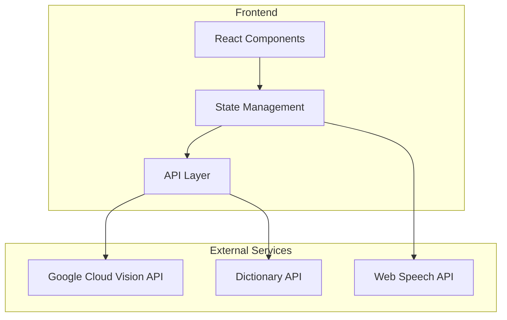
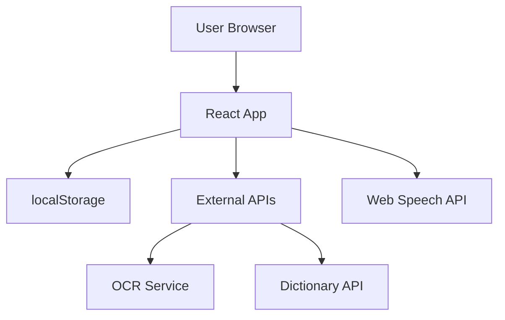
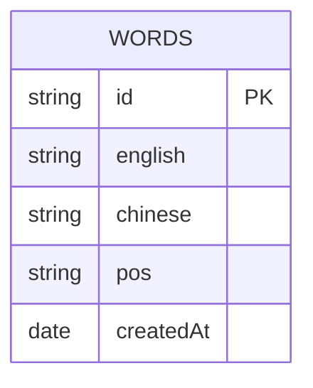

## 1. Architecture Design


## 2. Technology Description
- **Frontend**: React@18 + TypeScript + TailwindCSS@3 + Vite
- **Initialization Tool**: vite-init (react-ts template)
- **State Management**: Zustand
- **Icon Library**: lucide-react
- **OCR Service**: Google Cloud Vision API (或免费替代方案)
- **Speech Service**: Web Speech API (浏览器内置)
- **Dictionary Service**: Free Dictionary API (https://dictionaryapi.dev/)

## 3. Route Definitions
| Route | Purpose |
|-------|---------|
| / | 首页/单词列表页 |
| /settings | 听写设置页 |
| /dictation | 听写练习页 |
| /print | 打印预览页 |

## 4. API Definitions

### 4.1 单词数据结构
```typescript
interface Word {
  id: string;
  english: string;
  chinese: string;
  pos: string; // 词性
  createdAt: Date;
}
```

### 4.2 OCR识别
- **URL**: Google Cloud Vision API 或免费OCR服务
- **Method**: POST
- **Request**: 图片Base64编码
- **Response**: 识别出的文本字符串

### 4.3 单词查询
- **URL**: https://api.dictionaryapi.dev/api/v2/entries/en/{word}
- **Method**: GET
- **Response**: 
```typescript
interface DictionaryResponse {
  word: string;
  phonetic?: string;
  meanings: {
    partOfSpeech: string;
    definitions: {
      definition: string;
      example?: string;
    }[];
  }[];
}
```

### 4.4 语音合成
- **API**: Web Speech API (SpeechSynthesis)
- **参数**: text, rate, pitch, volume

## 5. Server Architecture Diagram
本项目为纯前端应用，无需后端服务。数据存储使用localStorage。



## 6. Data Model

### 6.1 Data Model Definition


### 6.2 LocalStorage Schema
```typescript
interface AppState {
  words: Word[];
  settings: {
    mode: 'chinese' | 'english'; // 报中文模式或报英文模式
    repeatCount: number; // 每词播报次数 1-5
    interval: number; // 间隔时间 1-10秒
    speed: 'slow' | 'medium' | 'fast'; // 语速
  };
}
```

## 7. Key Components

### 7.1 组件结构
```
src/
├── components/
│   ├── WordCard.tsx          # 单词卡片组件
│   ├── WordList.tsx          # 单词列表组件
│   ├── CameraModal.tsx       # 拍照识别弹窗
│   ├── AddWordModal.tsx      # 手动添加单词弹窗
│   ├── DictationSettings.tsx # 听写设置组件
│   ├── DictationPlayer.tsx   # 听写播放器组件
│   ├── DictationResult.tsx   # 听写结果组件
│   └── PrintPreview.tsx      # 打印预览组件
├── hooks/
│   ├── useOCR.ts             # OCR识别hook
│   ├── useDictionary.ts      # 字典查询hook
│   ├── useSpeech.ts          # 语音合成hook
│   └── useLocalStorage.ts    # localStorage hook
├── stores/
│   └── wordStore.ts          # Zustand状态管理
├── utils/
│   └── helpers.ts            # 工具函数
├── pages/
│   ├── Home.tsx              # 首页
│   ├── Settings.tsx          # 设置页
│   ├── Dictation.tsx         # 听写页
│   └── Print.tsx             # 打印页
└── types/
    └── index.ts              # 类型定义
```

## 8. Security Considerations
- **API密钥**: OCR API密钥存储在前端环境变量中，注意限制使用额度
- **数据安全**: 使用localStorage存储，仅在本地保存，不涉及敏感数据
- **HTTPS**: 部署时使用HTTPS协议，确保API请求安全